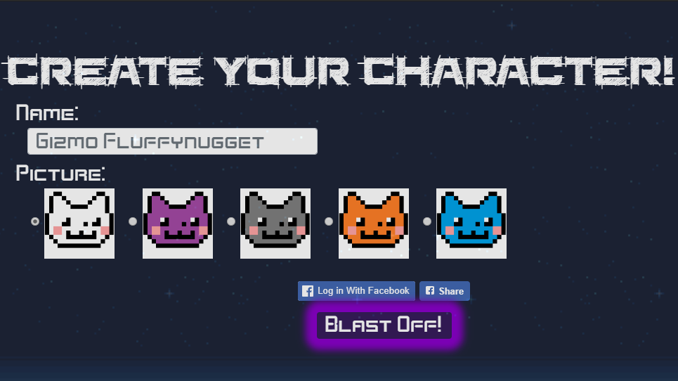
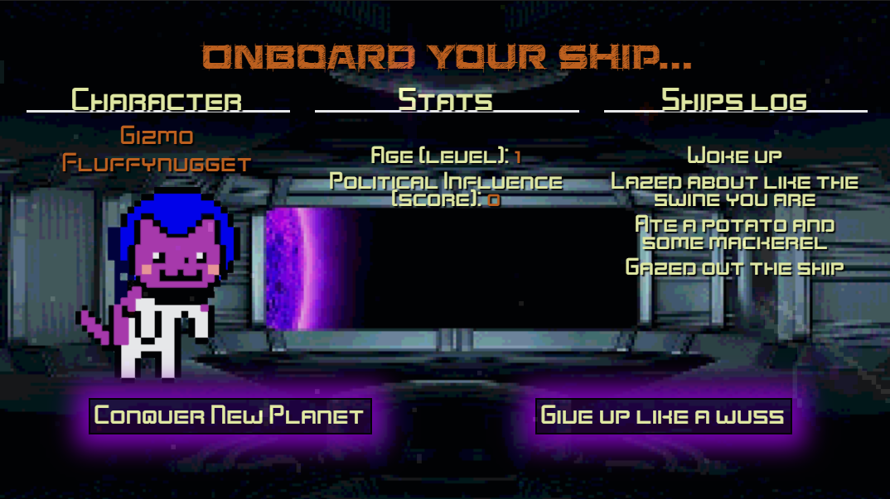
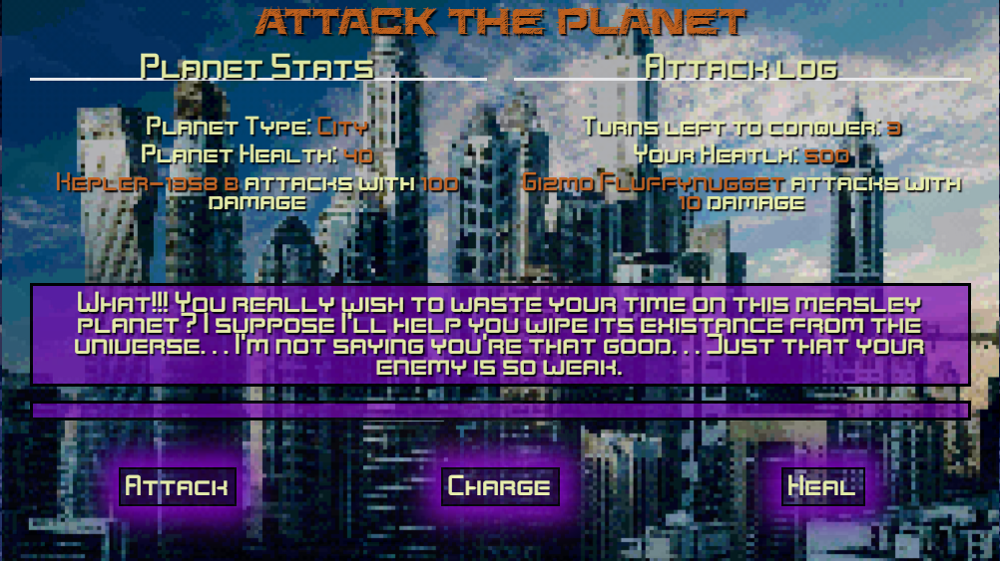
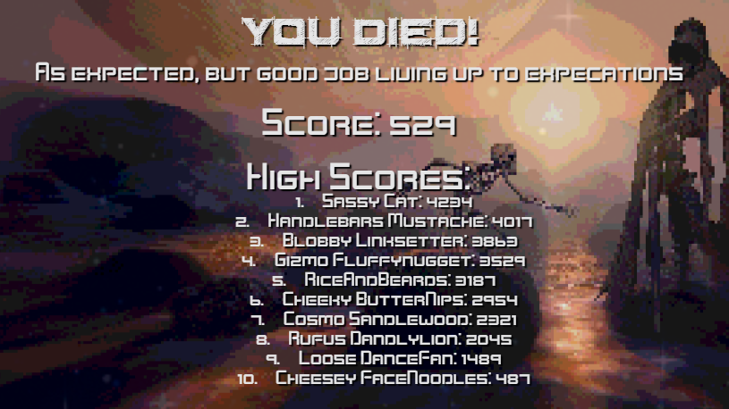

# Sassy Cat in Space
[Play the game everyone's talking about](https://secure-castle-53195.herokuapp.com/ "Sassy Cat in Space")

Image
 

## What is this "Sassy Cat" game of which you speak?
#### Sassy Cat in Space is a delightful little turn based galactic domination simulator.  If you have ever wondered what it would be like to hop into a ship that seems to hate you, fly to real exoplanets and attempt to conquer them in order to gain political power and rule the galaxy then this is your game.

### Gameplay
#### To begin the sassiness simply navigate to <https://secure-castle-53195.herokuapp.com/>. 

### Decide to play
#### Now that you've spent exactly 3 minutes and 14 seconds listening to the amazing music, press the "Click to Play" button.

Image
 

### Choose your character
#### This is your opportunity to create a meaningful and serious name.  Something like, Gizmo FluffyNugget or Cuckoo Cheesepants, possibly Steve?  Let your imagination run wild before controling it again, because you're an adult.  Once the name has been chosen you will need to select the cat face of your dreams then BLAST OFF!

Image
 

### Explore the ship
#### Finally, you've been given command of your very own ship, a sassy, sassy ship.  After your morning routine then you have two choices, "Conquer New Planet" or "Give Up Like a Wuss".  There is only one clear choice and that is to give up.  Good luck!

Image
 

### Dominate a random planet
#### You land on the first planet that is just begging to be conquered.  Before you lie three options.

* Attack - Fire all your laser swords at them and hope for victory
* Charge - Save your Phasoors and double the power
* Heal - Drink lots of Medkits and double your health

#### Make your choice and fire when ready.

Image
 

### Die, die, become a slave, die and then maybe win!
#### There is very little hope that you will ever win a game.  I suggest that you just give up now.  However, if you think you might be up to the challenge then you'll need to learn the patterns that the inhabitants of these planets use to defend themselves.  Once you've done that then galactic domination is yours!  

Image

 

 

## Getting started on your machine: 
* Clone the repo to your local machine
* Install the node packages as instructed below
* Create a local database
* Run the server.js in node
* Open a web browser and navigate to localhost:3000

## Prerequisites:
* Command Line interface
* NodeJS
* MySQL Workbench or equivalent program
* Web Browser

### Node packages (These are noted in the package.json)
#### Just run the command "npm i" from a terminal window while inside the same directory as server.js to install all dependant packages
* Dotenv
* Express
* MySQL
* MySQL2
* Sequelize

## Built With: 
* VS Code
* HTML5
* CSS3
* JavaScript
* NodeJS
* MySQL
* Heroku

## Authors in Alphabetical Order: 
* Matt Auretta
* Tim Lewis
* Trevor Li
* Bryan Nishi

## License
ISC

## Acknowledgments
DU's Full Stack Development Bootcamp
